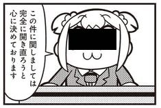
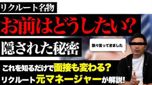
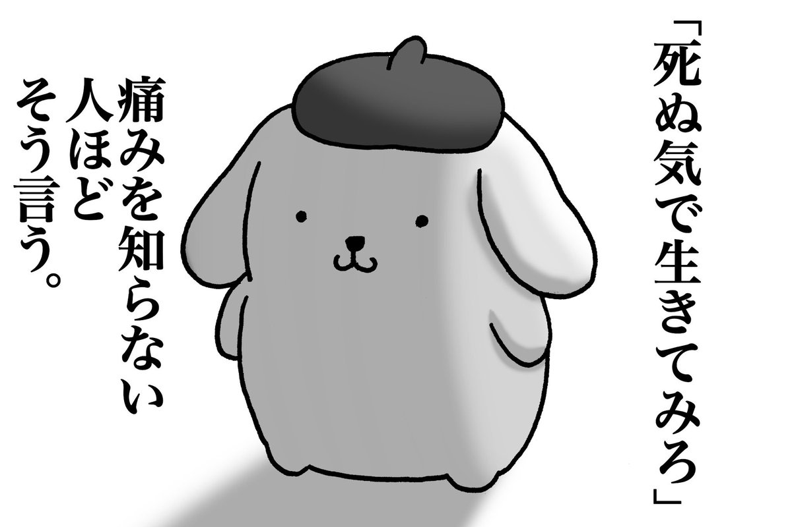
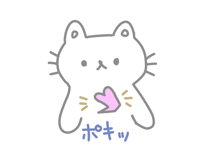
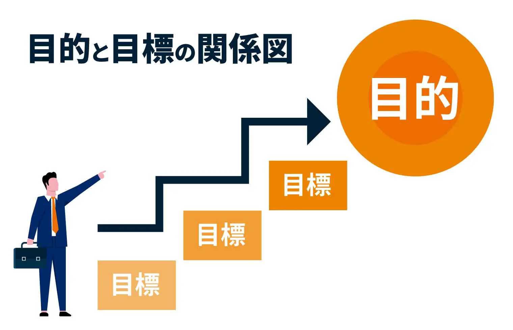

# 今日は僕が LT をするのだ！

#

  <h4>制限時間に怯えない！</h4>
  <h2 style="font-size: 60px; font-weight: bold;">
  クリックするだけの</h2>
  <h2 style="font-size: 60px; font-weight: bold;">
  楽々発表システム</h2>
  <h4>presented by ずんだもん</h4>

# Marp is 何？

- Marp は Markdown でスライドを作成できるツール
- プレゼンテーションのためのスライドをエディターで簡単に作成できる
- HTML や PDF などの形式で出力できる
- GitHub でのスライド管理も可能
- CSS や Assets でレイアウト、ソースを管理できる

# オススメ Marp 関連書籍

# 2. 年初にでかい目標を立てるのは負けフラグ

- 仕事始めたら忙しすぎて記憶から飛ぶ
- 手をつけにくく、先延ばしになりがち
- 年末に思い出して自己嫌悪パターン
    

→ 毎日小さい目標を積み重ねる
ex：「健康のため毎朝一杯の水を飲む」

# 3. 耳障りのいい願望では自分は動かせない

- 「どうなりたい」だけでは自分を動かせないことも
- 無理やり捻り出した目標は役に立たない
- 「どうなりたくない」の方が必死になって動ける
    

→ 危機感のある目標を立てると Good
ex： 起業後の金銭的不安/体型と健康への危機感

# 4. 自分に厳しくしたら心折れた

- わざわざ自分で責めなくても、十分周りが責めてくれる
- 自分を責めすぎると向上心を失う可能性も
- 自分に甘いのと自分に優しくするのは違う
    

→ 小さな成功を自分自身で全力で褒める
→ 他人からの褒め言葉を素直に受け入れる

# 5. 目標、目的、手段が混ざると人生の迷子になる

- タスクをこなすことに夢中になり、本来の目的を忘れがち
- 変わる方がいいのか変わらないほうがいいのかは人それぞれ
- 人生の迷子にならないために...
    
  → 定期的に自分の目標を振り返る
  → 目標に対して正しい目的と手段をしているか確認する

# まとめ

- 成功者の行動を何も考えずに真似すると詰む
- 年初にでかい目標を立てるのは負けフラグ
- 耳障りのいい願望では自分は動かせない
- 自分に厳しくしたら心折れた
- 目標、目的、手段が混ざると人生の迷子になる

#

  <h2 style="font-size: 80px; font-weight: bold;">
  おしまい！</h2>

＊この LT は、Marp を使ってマークダウンで作ったのだ！

  

