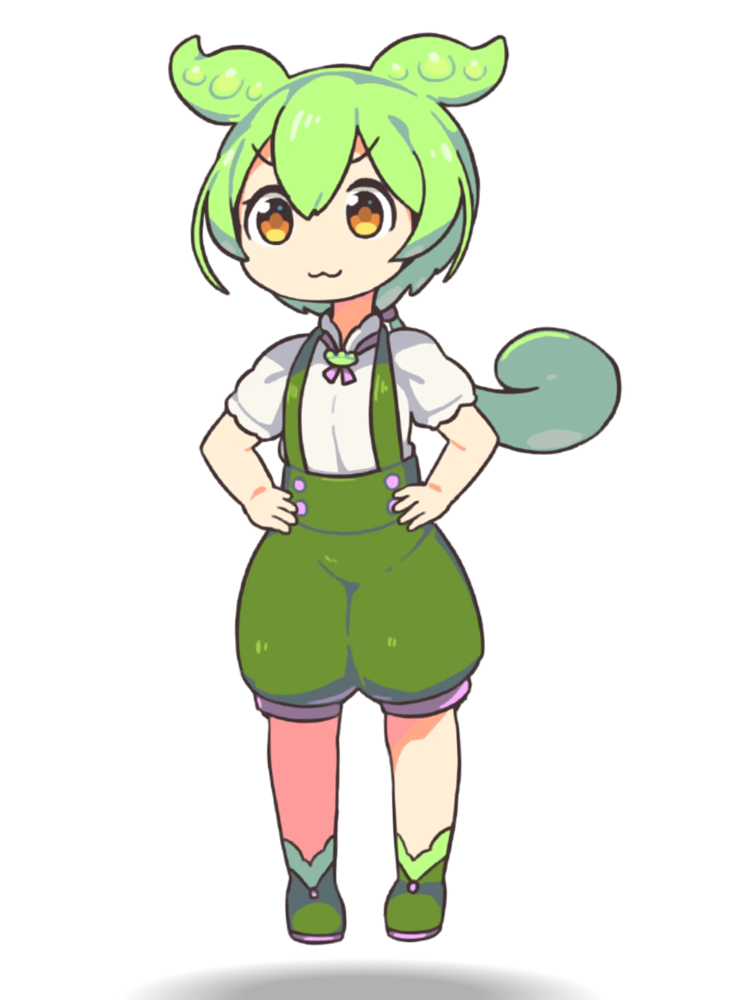
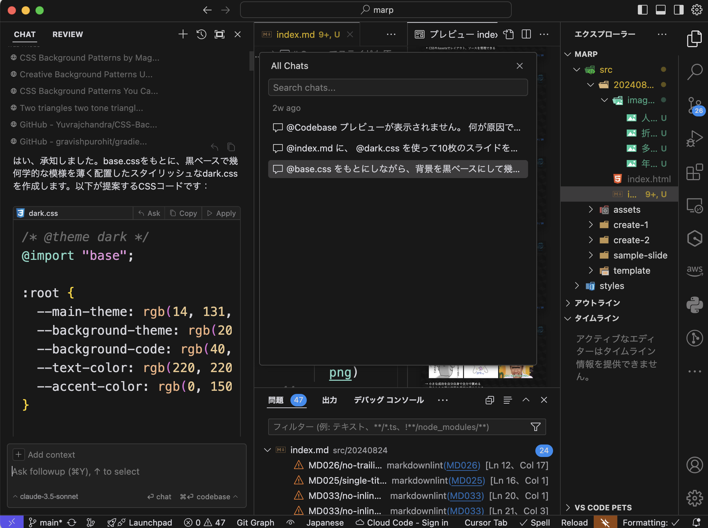
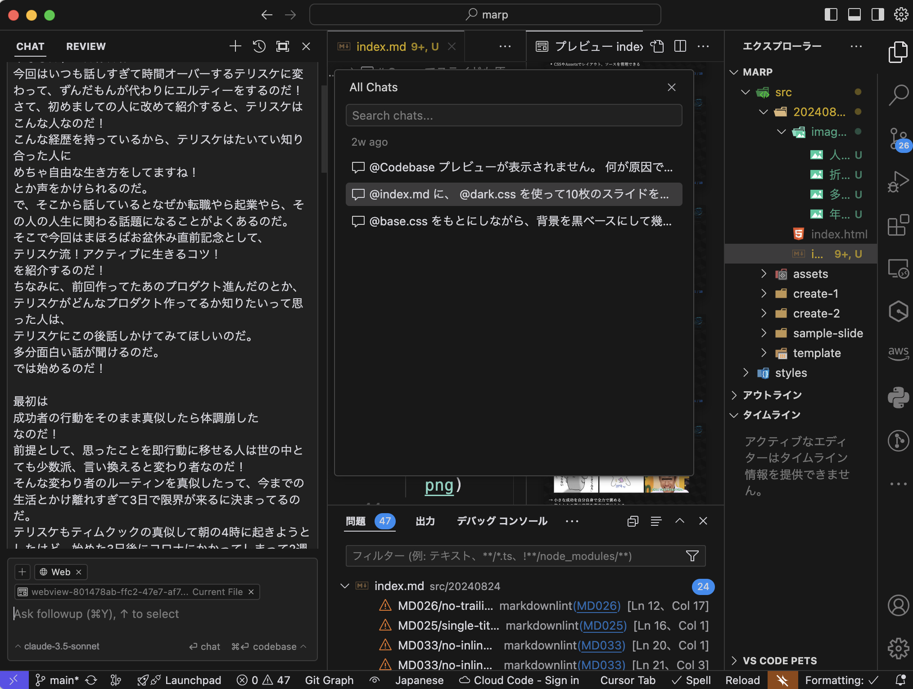
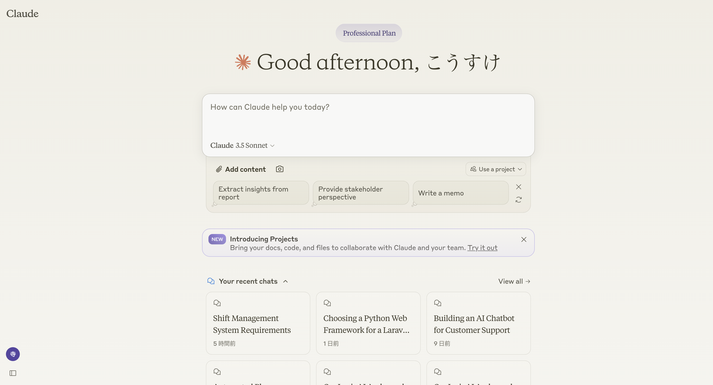
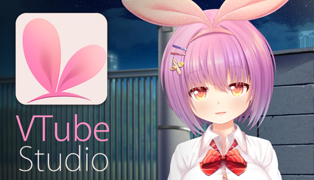
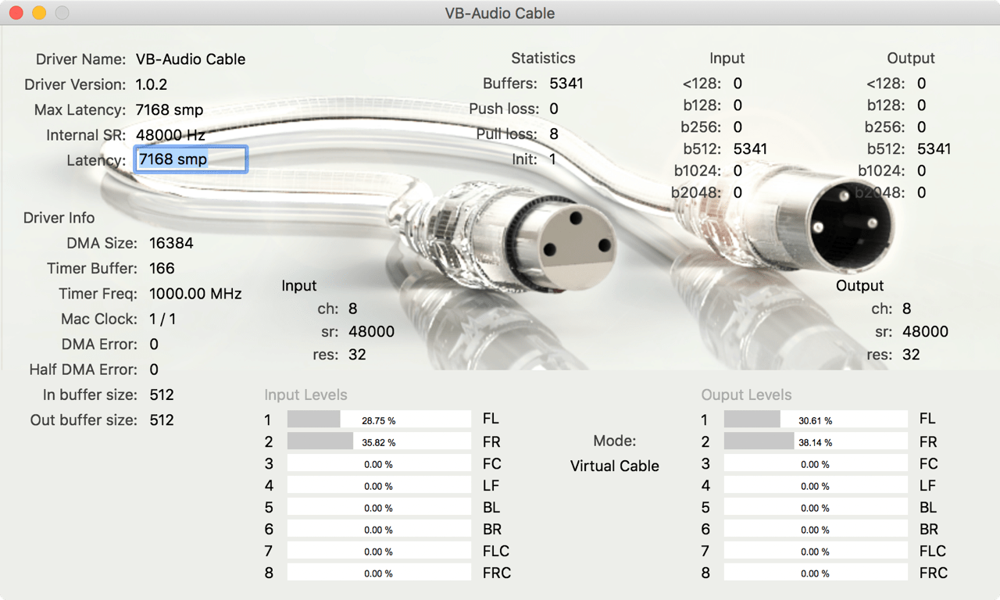

# 今日は僕が LT をするのだ！

#

  <h4>制限時間に怯えない！</h4>
  <h2 style="font-size: 60px; font-weight: bold;">
  クリックするだけの</h2>
  <h2 style="font-size: 60px; font-weight: bold;">
  楽々発表システム</h2>
  <h4>presented by ずんだもん</h4>

# Marp is 何？

- Marp は Markdown でスライドを作成できるツール
- プレゼンテーションのためのスライドをエディターで簡単に作成できる
- HTML や PDF などの形式で出力できる
- GitHub でのスライド管理も可能
- CSS や Assets でレイアウト、ソースを管理できる

# オススメ Marp 関連書籍

# Cursor でスライドも原稿も作れる！

- Cursor は Visual Studio Code ライクの AI エディタ
- サイドバーで AI と会話できる
- Claiude が AI アシスタントとしてオススメ
  

# ずんだもんに読み上げてもらう！

- VoiceVox でずんだもんのセリフを作成
- Vtube Studio でずんだもんのアバターを作成(無料)
  

# スライドとずんだもんを連携させる！

- 仮想ケーブルを使って、VoiceVox の音声を VTuber Studio に送信して口パク
- 音声出力をカスタムして、デバイスからも音声出力
- 完成なのだ！
    

#

  <h2 style="font-size: 80px; font-weight: bold;">
  おしまい！</h2>

＊この LT は、Marp を使ってマークダウンで作ったのだ！

  

