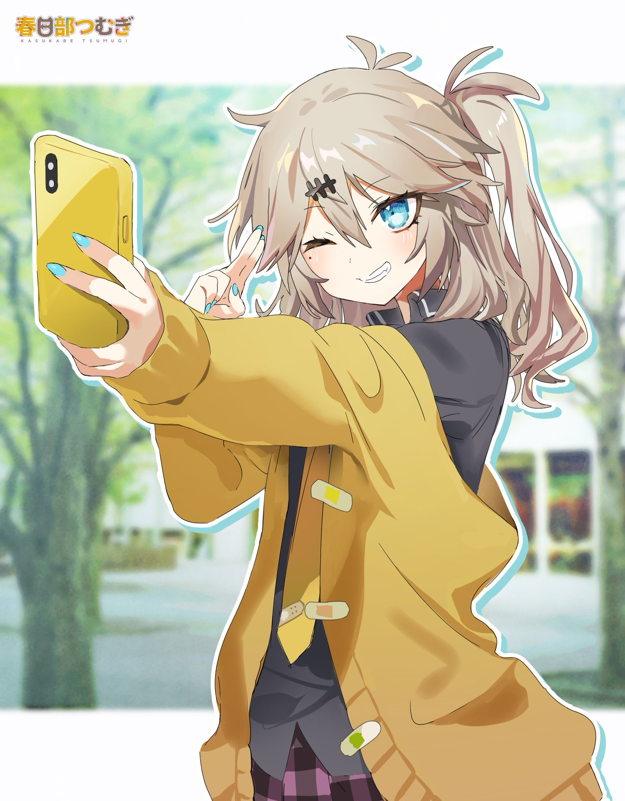
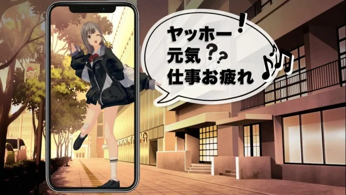
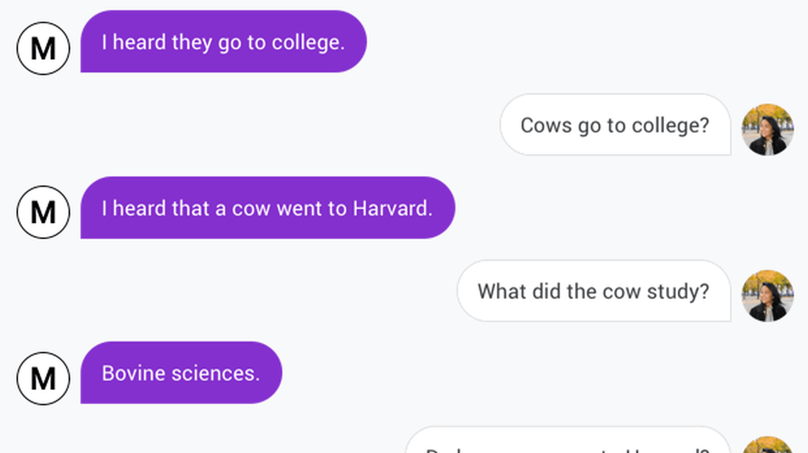
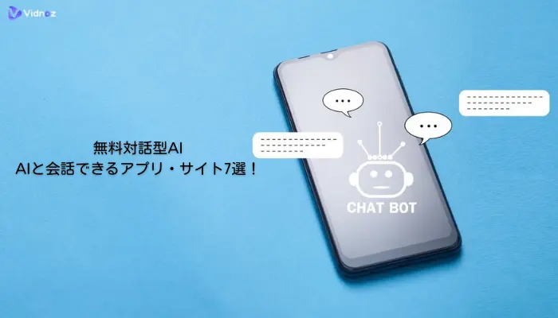
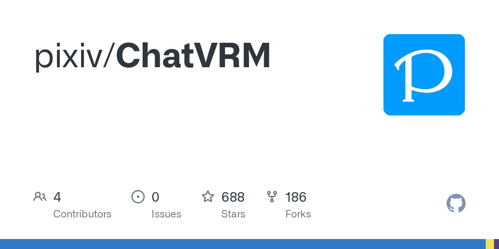
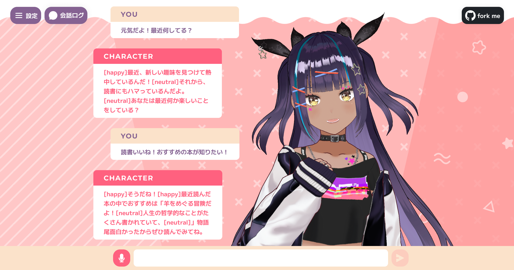
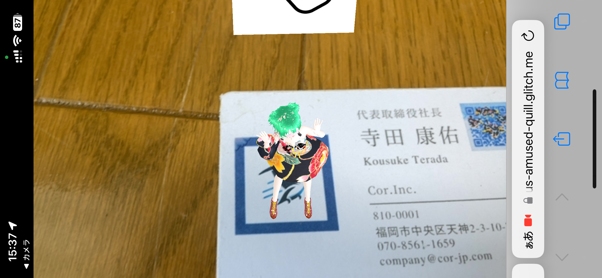
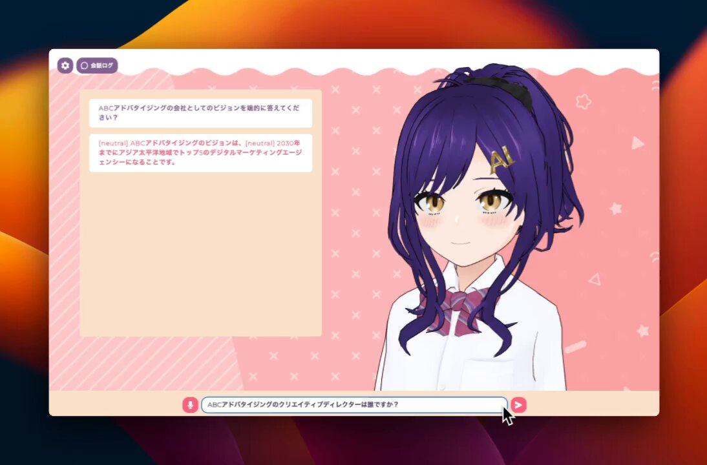
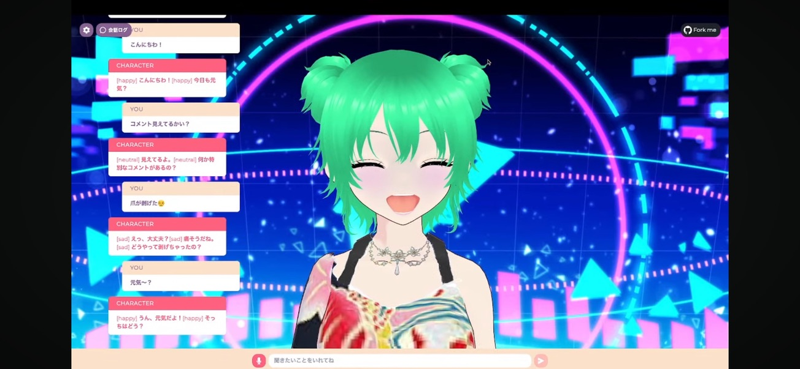
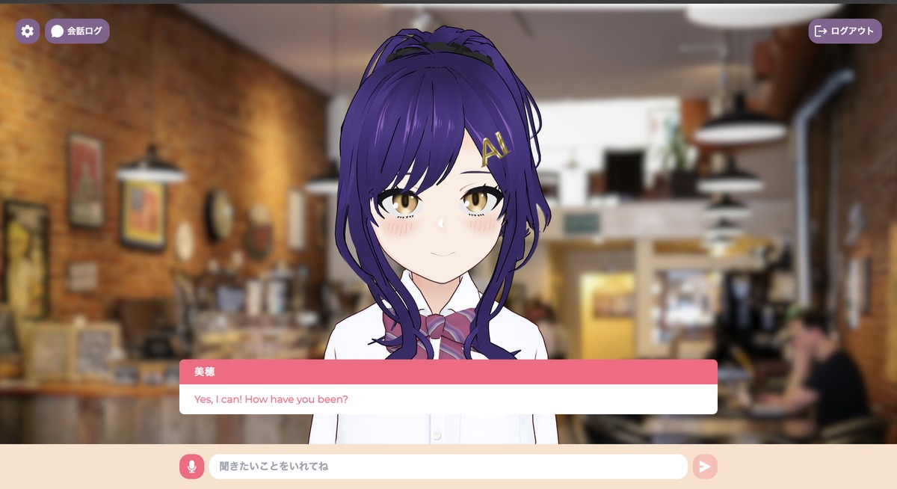

#

  <h4>いつもあなたに寄り添います！</h4>
  <h2 style="font-size: 60px; font-weight: bold;">
  AIパートナーを</h2>
  <h2 style="font-size: 60px; font-weight: bold;">
  作った話</h2>
  <h4>presented by テリスケ</h4>

# 経緯

- 最近の AI チャット精度上がってんなぁ・・・
- せや！AI が会話を仲介したら世界がもっと楽しくなるやん！
- とはいえハードル高すぎるから、まずはチャットできるアプリを作ろう！
- でも去年も似たようなシステム発表されていたなぁ・・・
- なんで流行らなかったのか、調べてみよう！

# なぜ流行らなかったのか？

- チャットではなく、会話できる AI が欲しい
- 自分から話しかけないと会話が成立しない
- 相手の顔や表情が見えないと人間らしさが感じられないから話が続かない
- 会話は途中であらぬ方向に進むことがあるから、会話に一貫性が欲しい
  

#### 結論/表情豊かで話に一貫性のある会話できる AI じゃないと流行らない！

# フロントに ChatVRM を採用しよう！

- Vrm という 3D モデルを使用してキャラクターを作ることができる
- Vroid で作った VRM モデルを使って、表情豊かな会話ができる
- フロントエンドから設定の変更ができる
- VRM なら以前使ったことがあるので、カスタムも簡単だった
  

# nike ちゃんの「AITuber」がすごい！

- 現在も週 1 で更新している
- Youtube 配信に対応しており、その他機能も豊富
- 会話継続モードなど、会話を続ける工夫がされている
- ただ、環境構築は初心者には難しい
    

#

# なぜか使ってもらえない・・・

- やっぱりこちらから話さないといけないので、話が続かない
- 自分の呼び方を変える機能が欲しい
- 外国語対応もしてほしい
- google ログイン以外も対応して欲しい

  

# 改善点

- ログインしたら話しかけてくれる機能追加
- 2 分間話しかけないと自動で話しかけてくれる機能追加(オプション)
- 5 つの表情の表示時間を調整、自然な表情変化を実現
- ボタンひとつでキャラクターを変更可能に！
- プロンプトもインターフェースも音声も、多言語対応
  

# 今後

- リファクタリング(Now)
- Dify との連携(Now)
- しばらく会話がないと画面から退場するモーション(来週)
- OpenAIAPI→Llama などローカル AI への乗り換え(9 月)
- モバイルアプリ化(11 月)
- **プロンプトやキャラデザ、キャラ設定の自動修正システム(10~11 月?)**

### 理想の AI パートナーへの旅はまだまだ続く・・・

# おしまい！

- AIPartner はこちらから！
  
- 今回の全自動プレゼンテーションはこちらから！
  

