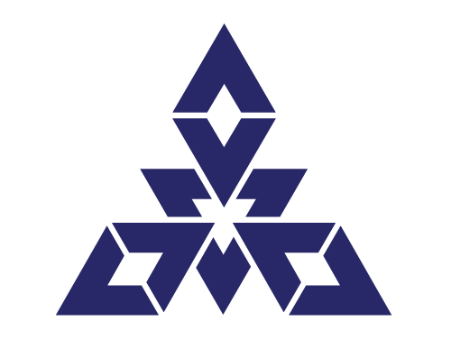

# Now Loading...

# テリスケ is 何？

- 音大卒業してフリーのトランペット奏者してました
- コロナで仕事が消え去ったので起業しようと思って青い Rに転職しました
- コロナで空いた時間使って簿記勉強してたら、タイピング早くなりました
- 営業なのに勝手に社内システム作って Python,Firebase 完全に理解しました ←
- 去年ジーズアカデミーに入って JavaScript も完全に理解しました ←
- 卒業後去年の年末に退職してソフトウェア開発で起業しました
- 今は React,GoogleCloud,TypeScript,Go,Terraform とか何もわからないです

#

  <h5>エーアイがいるから寂しくないもん</h5>
  <h3 style="font-size: 36px; font-weight: bold;">
  未経験ソフトウェア会社代表の</h3>
  <h3 style="font-size: 36px; font-weight: bold;">
  おひとり様仕事模様</h3>
  <h5>presented by テリスケ</h5>

# なぜに一人で法人？

- 法人登記していないとできないことがあった(研究用電話番号の取得とか)
- 主体的に多くの人と協力して事業が進めやすい
- 仕事の提案や資金調達をするときに信頼感が全然違う
- 会社名 or 名前で覚えてもらいやすい
- 福岡市がめっちゃ登記に協力的

<h4 align="center"> 多人数で自主開発をしたいなら起業がおすすめ</h4>

# 自社開発プロダクト

<h4 align="center">AIパートナー</h4>

- 自分好みの設定・キャラ名・キャラタイプの 3D モデルとお話しできる
- 直近の会話を覚えていて、向こうから話しかけてくれる

<h4 align="center">VR付きデジタル名刺</h4>

- デジタルで情報交換ができるし、従来の名刺のように渡すこともできる
- 指定したロゴから VR が飛び出す WebVR システムをつけている

  
  

# 個人開発との違い

- LT 会やコワーキングスペースで仲良くなった人と一緒に開発
- 連絡は主にスラックや ZOOM など
- 業務委託でプロジェクトごとに興味関心がある人をアサイン
- 熱意のある人しかいないので作業が早い
- ちょっとモン ◯ ンの協力プレイみたいで楽しい

  

# 提案営業みたいな受託を目指して

# AI システムの積極活用

| ChatGPT                        | Claude                         | Cursor\*Gemini                 | Genspark                        |
| ------------------------------ | ------------------------------ | ------------------------------ | ------------------------------- |
|  |  |  |  |

- それぞれ特徴にあった AI を使い分けて業務に使っている
- テリスケは AI 歓迎派(てかなければ起業できなかった)
- AI 使ったプロダクトもバンバン作っていくよ！
- だから寂しくない！寂しくないよ！

# おしまい！

- AIPartner はこちらから！
  
- 今回の全自動プレゼンテーションの記事
  

